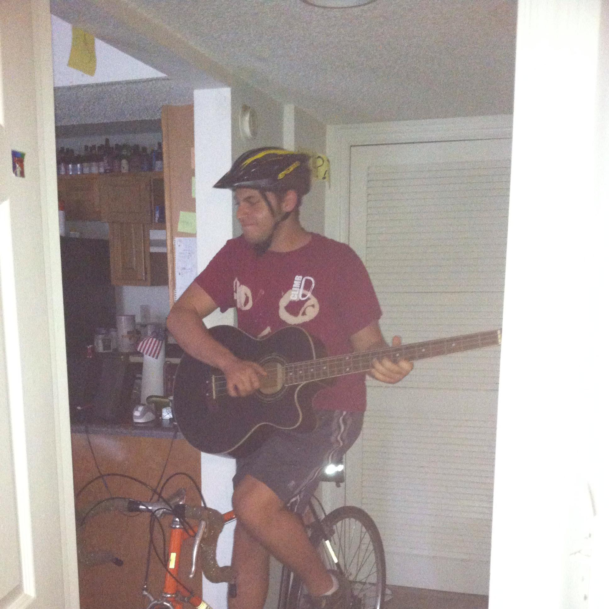

# Bicycle Delivery

In College I delivered sandwiches on a bicycle for a little while. Honestly it was the most "Fun" job I've ever had. Basically for like 8 hours a day I would bike around, get in shape, and get people their food. As I would ride by drunk college kids they would cheer at me like I was a rockstar. They'd be yelling "GO JIMMY GO" and I'd be getting in my daily exercise, and making some money at the same time.

Although I don't have any pictures of me as a delivery boy, I do have this picture which seems appropriate to the conversation.

Ultimately this job was short lived as it turns out engineering school is actually extremely stressful.
